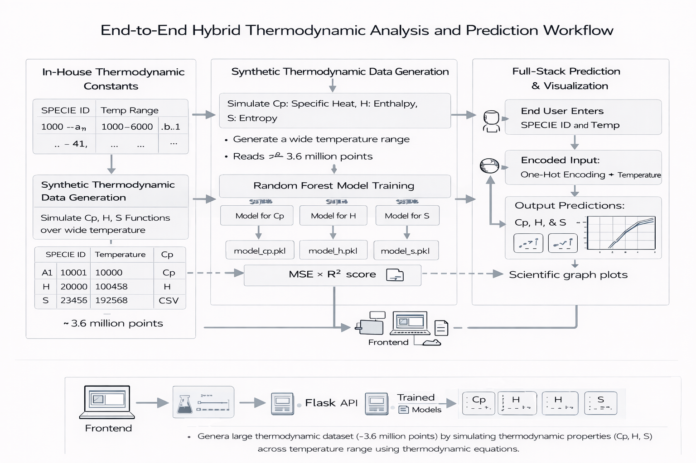
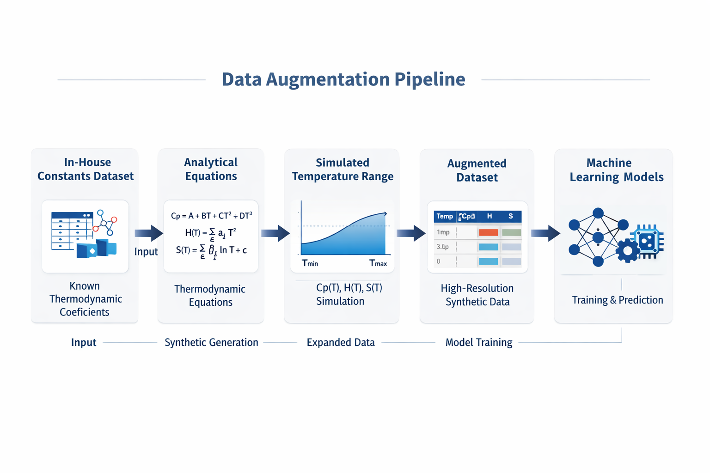
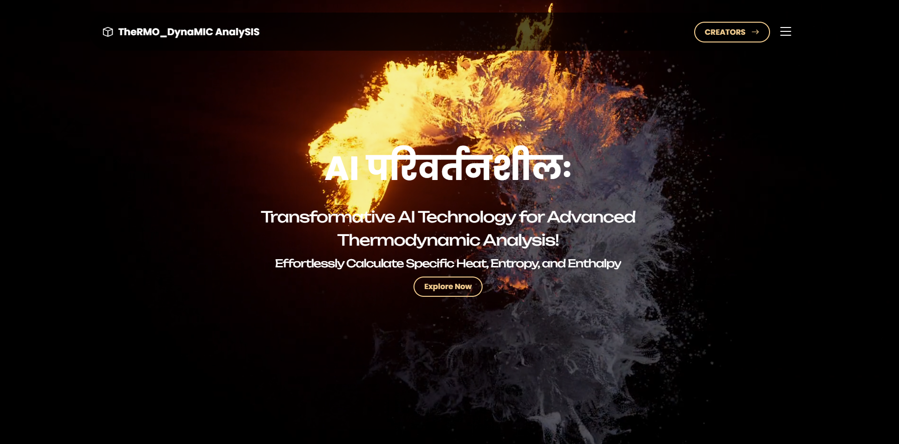
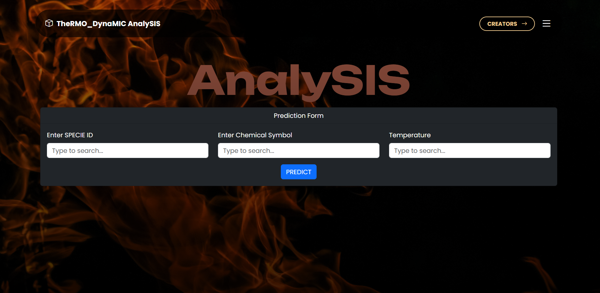
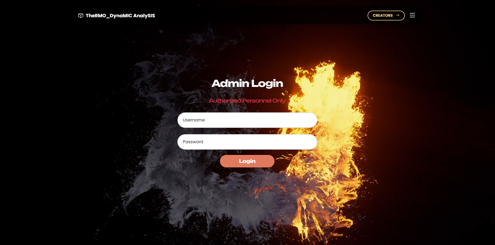
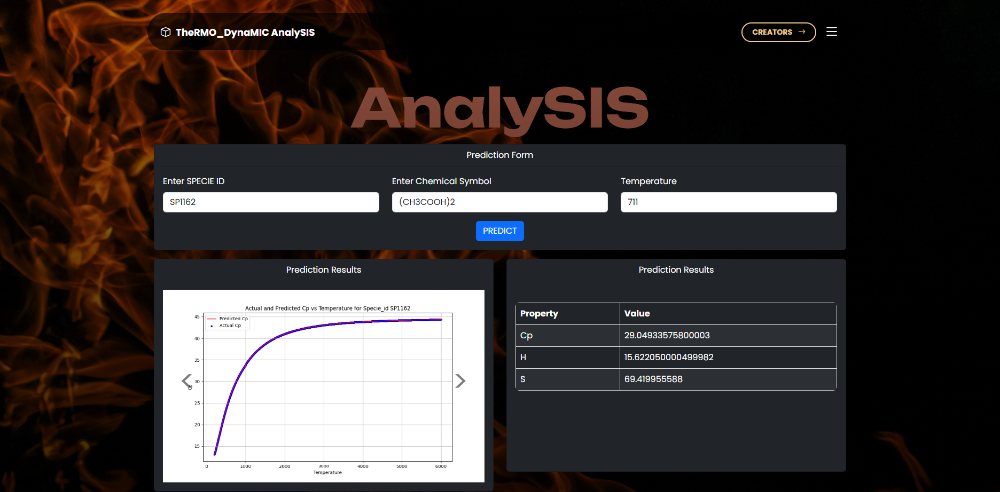

# 🔥 TheRMO_DynaMIC AnalySIS

> **A Hybrid Physics–Machine Learning System for High-Fidelity Thermodynamic Property Prediction**



**Hybrid Physics–Machine Learning Platform for Thermodynamic Property Prediction**

TheRMO_DynaMIC AnalySIS is an end-to-end scientific machine learning system that integrates thermodynamic theory with data-driven modeling to predict temperature-dependent material properties — specific heat capacity (Cp), enthalpy (H), and entropy (S).

This project demonstrates a hybrid approach where physics-based equations are used to generate large-scale synthetic datasets, which are then used to train machine learning models for fast and accurate inference.

---

## 🚀 Why This Matters (Scientific Contribution)

Modern thermodynamic property estimation relies on sparse experimental data and expensive simulations. This project demonstrates a scalable alternative: using physics-based equations to synthesize large, high-resolution datasets and training machine learning models as fast surrogate predictors.

This enables:

* High-fidelity prediction without expensive recomputation
* Continuous property estimation over temperature ranges
* Generalization across thousands of chemical species

This hybrid Physics–ML approach significantly reduces computational cost while maintaining physical consistency.

---

## 🧠 Scientific & Technical Innovations

* **Physics-Guided Data Augmentation**: Expanded a limited in-house dataset into over **3.6 million temperature-resolved samples** using analytical thermodynamic equations.
* **Hybrid Modeling**: Combined first-principles equations with supervised ML to build fast surrogate models.
* **Sign-Stable Learning**: Designed preprocessing to handle extreme magnitudes and negative enthalpy values safely.
* **Multi-Target Regression**: Simultaneously modeled Cp, H, and S as continuous functions of temperature and species.
* **Scientific Validation**: Compared predicted curves against analytical baselines for every species.

---

## Key Contributions

* Designed a hybrid Physics–ML pipeline combining thermodynamic equations with supervised learning
* Generated a synthetic dataset of over **3.6 million thermodynamic samples** from in-house constants
* Trained Random Forest regression models for Cp, H, and S prediction
* Built a full-stack Flask web application for interactive prediction and visualization
* Implemented automated training, evaluation, and plotting pipelines

---

## System Architecture


The system consists of four layers:

1. Physics-based data generation
2. Machine learning model training
3. Backend prediction API
4. Frontend visualization and interaction

---

## Thermodynamic Data Augmentation



Starting from a limited in-house thermodynamic constants dataset, the system expands the data by simulating Cp(T), H(T), and S(T) across temperature ranges using analytical thermodynamic equations. This transforms sparse experimental data into a large, high-resolution synthetic dataset suitable for machine learning.

---

## Machine Learning Models

| Property | Model                   | Features                      | Metric  |
| -------- | ----------------------- | ----------------------------- | ------- |
| Cp       | Random Forest Regressor | Temperature + Encoded Species | R², MSE |
| H        | Random Forest Regressor | Temperature + Encoded Species | R², MSE |
| S        | Random Forest Regressor | Temperature + Encoded Species | R², MSE |

Categorical variables are encoded using One-Hot Encoding, and models are trained on the augmented dataset.

---

## Web Application

### Home & Landing Page



### Analysis & Prediction Interface



### Admin Dashboard (Data Generation & Training)


### Secure Login



### Prediction Visualization



The platform provides:

* Secure login for administrators
* CSV upload for thermodynamic constants
* Automatic dataset generation and model training
* Interactive prediction interface
* Scientific plots comparing predicted vs analytical values

---

## How to Run

```bash
pip install -r requirements.txt
python app.py
```

Open `http://localhost:5000` in your browser.

---

## Technologies

* Python
* Pandas, NumPy, Scikit-learn
* Random Forest Regressor
* Flask
* HTML, CSS, JavaScript
* Matplotlib

---

## Academic Context

This project demonstrates how physics-informed simulation can be combined with machine learning to accelerate scientific computation and enable fast surrogate modeling for thermodynamic systems.

---

## Author

**Ashish Joshi**
MS in Artificial Intelligence, Boston University

---

## Full Code & Reproducibility

The full experimental pipeline (including large-scale data generation, training runs, and Colab notebooks) is not fully included here due to size and compute constraints.

If you are a recruiter, researcher, or collaborator and would like:

* Access to the full training notebooks
* A Google Colab reproducible version
* Extended datasets or experiments

Please contact me directly.

---

## Asset Attribution

Some UI illustrations, background visuals, and decorative assets used in the web interface may originate from open-source or free design resources available online (for example Unsplash, Freepik, or similar platforms). All such assets are used under their respective free-use licenses. If you believe any asset requires additional attribution or removal, please contact me and I will address it immediately.

---

## License

**All Rights Reserved.**
Copyright © 2026 Ashish Joshi

This repository is published for viewing and evaluation purposes only. You may not copy, modify, redistribute, or use this code or any part of it for commercial or academic purposes without explicit written permission from the author.
